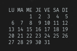
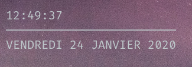
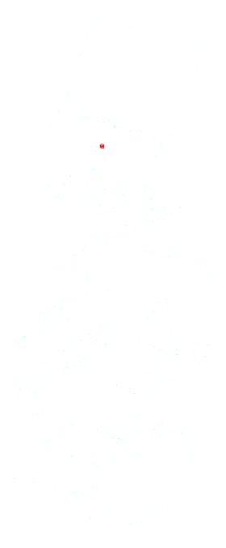

# Conky collection

Sekumpulan konfigurasi Conky dan skrip bantuan untuk memonitor sistem dan layanan.

Isi repo:

- `conf/` — direktori konfigurasi, setiap subfolder berisi satu konfigurasi Conky dan skrip terkait.
- `conky-configure.sh`, `conky-launch.sh` — skrip helper di root.
- `fonts/` — font tambahan (jika ada).

Contoh konfigurasi yang tersedia (subfolder di `conf/`):

- `conky-altcoin-monitor`
- `conky-bluetooth-monitor`
- `conky-calendar`
- `conky-clock`
- `conky-computer-metrics`
- `conky-exploded-view`
- `conky-fortune`
- `conky-mini-playerctl`
- `conky-pingbeat`
- `conky-rss-reader`
- `conky-weather`
- `conky-xfce-workspace-indicator`

Persyaratan

- `conky` terinstal di sistem Anda.
- Beberapa konfigurasi memerlukan dependensi tambahan (mis. `curl`, `playerctl`) — lihat file `fetch.sh` atau dokumentasi di masing-masing subfolder.

Cara cepat pakai

1. Salin konfigurasi yang diinginkan ke lokasi Conky Anda, contoh:

```bash
cp conf/conky-clock/conky-clock ~/.conkyrc
conky &
```

2. Atau gunakan skrip launcher (jika sudah disesuaikan):

```bash
./conky-launch.sh
```

Menambahkan konfigurasi baru

- Buat folder baru di `conf/` dengan nama konfigurasi.
- Tambahkan file Conky (mis. `conky-myconfig`) dan skrip bantuan jika perlu.

Lisensi

Proyek ini dilisensikan di bawah MIT License — lihat file `LICENSE`.

Kontribusi

Pull request dan issue diterima. Tambahkan `CONTRIBUTING.md` jika ingin aturan kontribusi khusus.

Screenshots

Contoh tampilan hasil konfigurasi (klik untuk memperbesar):

- Calendar:

	

- Clock:

	

- Exploded view background:

	

- Mini player cover example:

	

