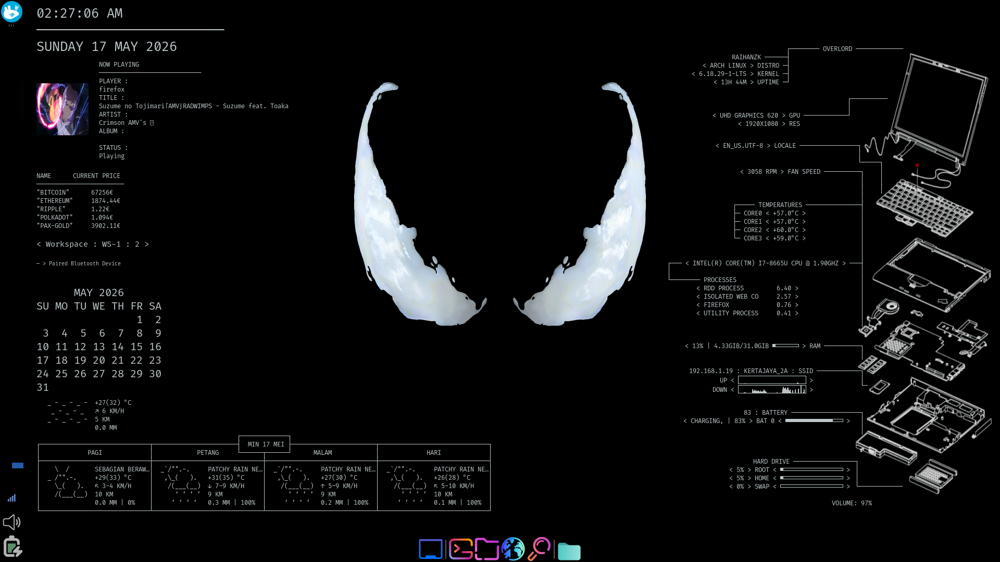

# Conky collection

Sekumpulan konfigurasi Conky dan skrip bantuan untuk memonitor sistem dan layanan.

Isi repo:

- `conf/` — direktori konfigurasi, setiap subfolder berisi satu konfigurasi Conky dan skrip terkait.
- `conky-configure.sh`, `conky-launch.sh` — skrip helper di root.
- `fonts/` — font tambahan (jika ada).

Contoh konfigurasi yang tersedia (subfolder di `conf/`):

- `conky-altcoin-monitor`
- `conky-bluetooth-monitor`
- `conky-calendar`
- `conky-clock`
- `conky-computer-metrics`
- `conky-exploded-view`
- `conky-fortune`
- `conky-mini-playerctl`
- `conky-pingbeat`
- `conky-rss-reader`
- `conky-weather`
- `conky-xfce-workspace-indicator`

Persyaratan

- `conky` terinstal di sistem Anda.
- Beberapa konfigurasi memerlukan dependensi tambahan (mis. `curl`, `playerctl`) — lihat file `fetch.sh` atau dokumentasi di masing-masing subfolder.

Dependencies

Berikut paket/program yang digunakan oleh beberapa konfigurasi dalam repo ini:

- `conky` — core (required)
- `curl` — mengambil data cuaca, RSS, dan API eksternal
- `jq` — memproses JSON (digunakan di `conky-altcoin-monitor`)
- `playerctl` — kontrol/ambil metadata pemutar media (digunakan di `conky-mini-playerctl`)
- `python3` — helper kecil untuk encoding query (dipakai di `get-cover.sh`)
- `grep`, `sed`, `awk` — utilitas teks standar yang dipakai di beberapa skrip

Instalasi contoh (pilih sesuai distro):

Debian/Ubuntu:

```bash
sudo apt update
sudo apt install -y conky curl jq python3 playerctl
```

Arch Linux / Manjaro:

```bash
sudo pacman -Syu
sudo pacman -S --noconfirm conky curl jq python playerctl
```

Fedora:

```bash
sudo dnf install -y conky curl jq python3 playerctl
```

Catatan:

- Beberapa fitur bergantung pada pemutar media yang mendukung MPRIS (mis. Spotify, VLC, mpv). `playerctl` hanya bekerja jika pemutar menyediakan interface MPRIS.
- Jika Anda menemukan skrip yang memerlukan program lain (mis. `imagemagick`, `scrot`, dsb.), akan disebutkan di dokumentasi subfolder terkait.


Cara cepat pakai

1. Salin konfigurasi yang diinginkan ke lokasi Conky Anda, contoh:

```bash
cp conf/conky-clock/conky-clock ~/.conkyrc
conky &
```

2. Atau gunakan skrip launcher (jika sudah disesuaikan):

```bash
./conky-launch.sh
```

Menambahkan konfigurasi baru

- Buat folder baru di `conf/` dengan nama konfigurasi.
- Tambahkan file Conky (mis. `conky-myconfig`) dan skrip bantuan jika perlu.

Lisensi

Proyek ini dilisensikan di bawah MIT License — lihat file `LICENSE`.

Kontribusi

Pull request dan issue diterima. Tambahkan `CONTRIBUTING.md` jika ingin aturan kontribusi khusus.

Screenshots

Full display example:



